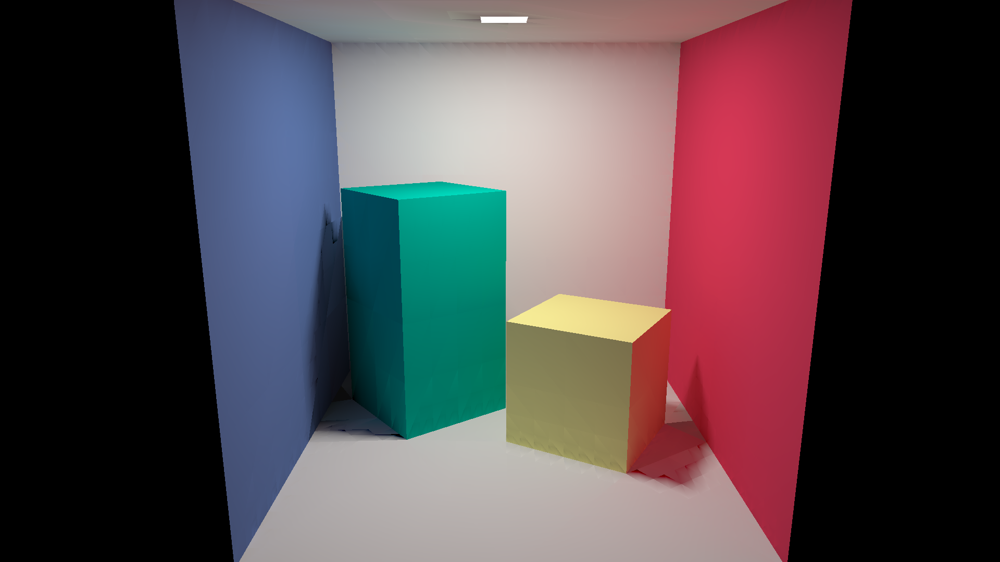
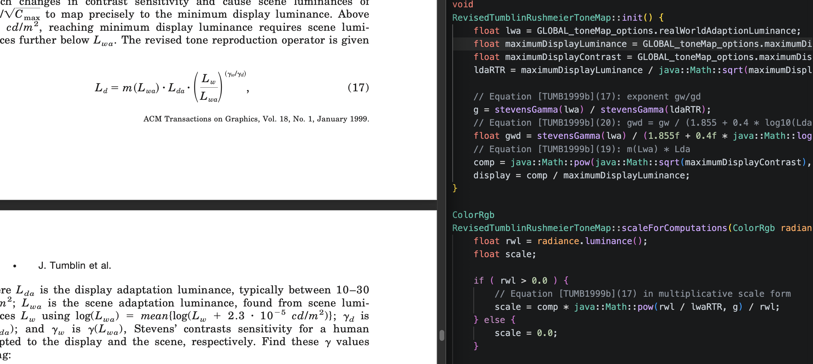

# rpkCpp
Modernized version of RenderPark radiosity engine.

Original software from 2001 is available on
[https://graphics.cs.kuleuven.be/renderpark/](https://graphics.cs.kuleuven.be/renderpark/).

## C++ specific notes

The C++ modernization checklist and architecture notes are now in
[cpp/README.md](./cpp/README.md).

## Java app notes

The Java 17 Gradle app notes are in
[java/README.md](./java/README.md).

## What RPK program does

Basically, this program has two use cases:
- Galerkin / geometric subdivision view independent solution.
- Raytracer solution: Check the use of `RAYTRACING_ENABLED` macro on how to remove this code from project.

The program is a command line application that reads a geometry description in [MGF file format](./doc/references/mgfFileFormatSpecs/), computes the 3D image and writes the resulting image in ppm format (note that Galerkin geometry is also exported in VRML). For example, [this scene](./etc/cube.mgf) is rendered as the classic Cornell Box:



## Annotated math in code with respect to references

Papers to understand the code are included in [doc/references](./doc/references). Where identified, key equations in code are annotated with citations to original papers or book chapters.

Here is an example:


## Install prerequisites

### On linux

```bash
apt-get install cmake build-essential freeglut3-dev libglu1-mesa-dev libosmesa6-dev findimagedupes
```

### On MacOS

```bash
brew install mesa cmake
```

## Build program

```bash
mkdir build
cd build
cmake ..
make
cd ..
```

Generated images will be written at `./output` folder, reading models from `./etc`.

## Optional OpenGL/GLUT support

OpenGL support is controlled from CMake with `OPEN_GL_ENABLED` (default: `ON`).

- If `OPEN_GL_ENABLED=OFF`, OpenGL-dependent modules are not compiled and not linked into `rpk`.
- If `OPEN_GL_ENABLED=ON` but required OpenGL/GLUT libraries are not found, CMake automatically disables OpenGL support for that build.
- The runtime debug window option `-glutDebug` requires OpenGL support.

Examples:

```bash
# Build with OpenGL/GLUT support (default)
cmake -S . -B build -DOPEN_GL_ENABLED=ON
cmake --build build -j
```

```bash
# Build without OpenGL/GLUT support
cmake -S . -B build -DOPEN_GL_ENABLED=OFF
cmake --build build -j
```

If a binary compiled without OpenGL support is run with `-glutDebug`, the program exits with an error message asking to recompile with `-DOPEN_GL_ENABLED=ON`.

## Selecting Niederreiter variant (31-bit vs 63-bit)

The quasi-Monte-Carlo Niederreiter implementation provides:

- A generic API in `Niederreiter.h`: `Nied`, `NextNiedInRange`, `radicalInverse`, `foldSample`.
- Explicit APIs per variant:
  - 31-bit: `niederreiter31`, `NextNiedInRange31`, `radicalInverse31`, `foldSample31`
  - 63-bit: `Nied63`, `NextNiedInRange63`, `radicalInverse63`, `foldSample63`

Variant selection for the generic API is compile-time:

- Default build (without `NOINT64`): uses 63-bit variant.
- Build with `NOINT64` defined: uses 31-bit variant.

Examples:

```bash
# 63-bit (default)
cmake -S . -B build
cmake --build build -j
```

```bash
# 31-bit (force by disabling 64-bit Niederreiter generic API)
cmake -S . -B build -DCMAKE_CXX_FLAGS="-DNOINT64"
cmake --build build -j
```

Note: modules calling explicit `*31`/`*63` functions keep using that exact variant by design.

## Running RPK program from the command line

The following command will run all the samples located on the `./etc` folder and generate output
files on `./output` folder.

```bash
./scripts/runAll.sh
```

Note that for verification purposes, the output images can be compared against the copies on `./doc/testBaseImages`.
For checking if last run is successful, try

```bash
./scripts/testReviewResults.sh
```

## Running program on old hardware

Newer compilers uses specific machine instructions that are available only on newest hardware
(i.e. AVX512). If running the `rpk` executable is giving error, disable the generation of
such optimizations by removing the following line on `CMakeLists.txt`:

```bash
add_compile_options(-ffast-math -O3)
```

## Running under profiler control (linux + gprof)

```bash
cmake -B build -DCMAKE_BUILD_TYPE=Release -DCMAKE_CXX_FLAGS="-pg" -DCMAKE_C_FLAGS="-pg"
cmake --build build
```

Then run any rpk command. After the run a `gmon.out` binary data files will be generated, from which

```bash
gprof ./build/rpk gmon.out > analysis.txt
less analysis.txt
```

will help on optimizing code.
